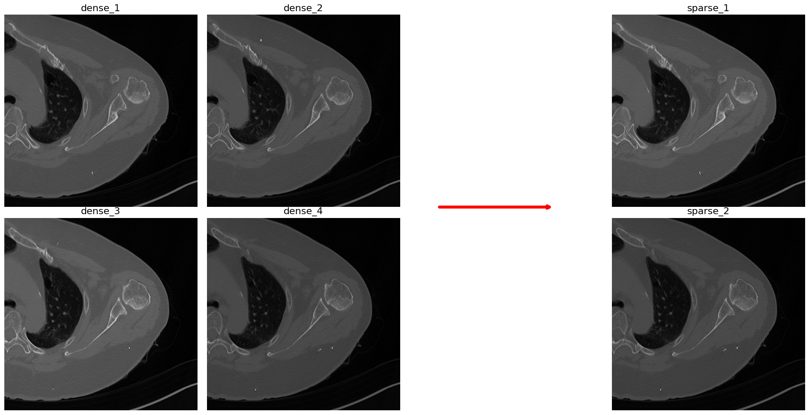

---

# 3D CT Resample

This repository provides CT resampling code and example code (excluding data), which was used for processing data from **Asan Medical Center**.  
You can easily resize a CT image using the refactor_size_list argument.  
  
For example, if the CT image has a shape of (512, 512, 96) and you set refactor_size_list to (0.5, 0.5, 1/3), you can resample it to a shape of (256, 256, 32). The resulting series slices can then be saved in the DICOM file format.  
You can choose either SimpleITK or scipy's zoom to perform resampling.

  

  <b>Figure 3:</b> Dense CT Image (left), Sparse CT Image (right).

1. **Extracting and Organizing Axial Series from Mixed Series Data**  
   Refer to the notebook: `0_Extract_Axial_Series.ipynb`  
   In real-world datasets, Axial, Sagittal, and Coronal images, or even Scout images, may be mixed together.  
   Here is an example of a script that extracts and organizes Axial images when such data is stored in a single folder.  

2. **Resample 3D CT**  
   Here is an example of code for resampling a CT series.  
   Refer to the notebook: `1_Resample_CT_Series.ipynb`

### Usage
   The steps for resampling are as follows:  
   **Step 1**: Use `utils.resize_dicom_series` to resample the **SimpleITK image** and obtain the **resampled sitk_image object**.  
   **Step 2**: Use `utils.write_series_to_path` to write **SimpleITK image(3D CT Series)** to target folder.  
  
   For more details, refer to the docstrings of `utils.resize_dicom_series` and `utils.write_series_to_path`.   

### Future Work

We are currently preparing a research paper on **CT-Super-Resolution** based on the methods demonstrated in this repository.

### To-DO

I referred to a repository for the `utils.resize_dicom_series_sitk`, but I am currently unable to locate it to add the proper reference. I will include the reference as soon as I find it.  

### Contact

If you have any questions or suggestions, feel free to reach out via:  
📧 **Email**: tobeor3009@gmail.com  
💬 **GitHub Issues**

--- 

Let me know if you need further refinements! 😊
